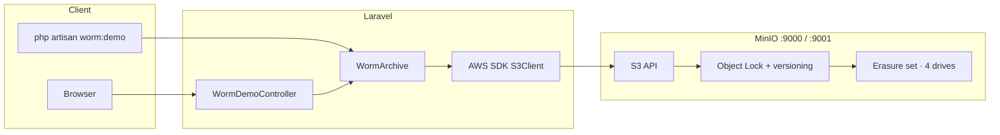
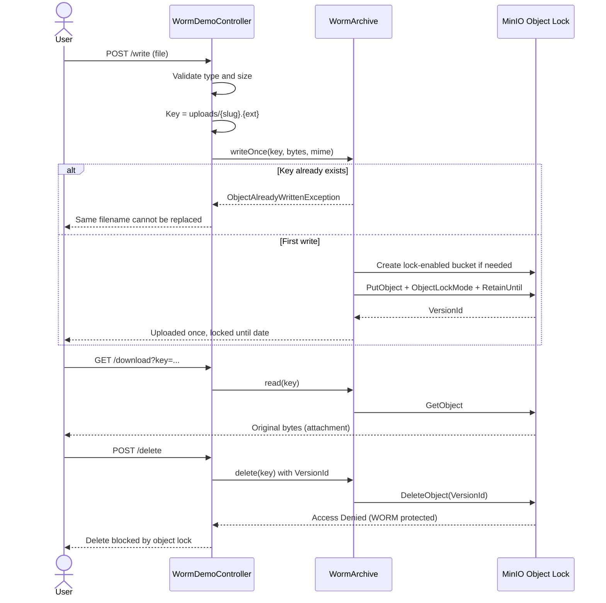
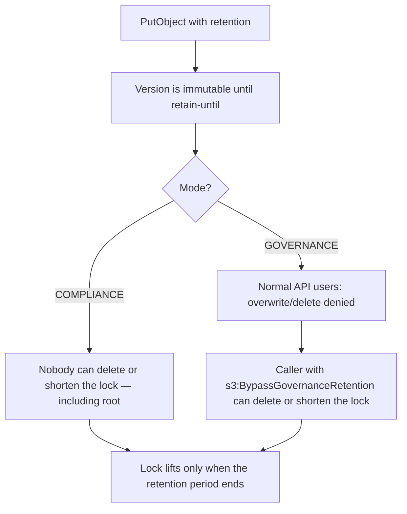
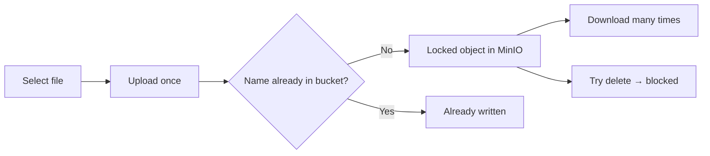

# WORM Storage

Write Once, Read Many object storage on **MinIO** (S3-compatible)

A file can be uploaded once. It can be downloaded many times. Overwrite of the same name is rejected by the application. Delete of that object version is rejected by MinIO Object Lock until retention expires.

---

## How it fits together

The browser never talks to MinIO. Laravel accepts the upload, sanitizes the filename into an object key (`uploads/my-invoice.pdf`), then the AWS SDK calls the S3 API on MinIO.



Default local endpoints:

| Service | URL | Credentials |
| --- | --- | --- |
| Demo app | http://127.0.0.1:8000 | — |
| MinIO S3 API | http://127.0.0.1:9000 | `minioadmin` / `minioadmin` |
| MinIO console | http://127.0.0.1:9001 | `minioadmin` / `minioadmin` |
| Bucket | `worm-archive` | Created on first write, with lock enabled |

Path-style addressing is required locally (`AWS_USE_PATH_STYLE_ENDPOINT=true`). Virtual-host style (`bucket.s3.amazonaws.com`) does not work against `127.0.0.1`.

---

## WORM lifecycle

Two independent protections:

1. **Application** — `writeOnce()` refuses a key that already exists.
2. **MinIO Object Lock** — the stored *version* cannot be deleted until the retain-until date, even if someone bypasses the app.



---

## Object Lock modes

Configured in `.env` as `WORM_LOCK_MODE`. The demo defaults to **GOVERNANCE** so a local experiment is not permanently undeletable.



| Mode | Everyday overwrite / delete | Privileged bypass | Use when |
| --- | --- | --- | --- |
| `GOVERNANCE` | Blocked | Allowed if the caller sends `BypassGovernanceRetention` | Internal policy; ops may still clean a bad write |
| `COMPLIANCE` | Blocked | **Impossible** until expiry | Legal / regulatory archive |

The demo never sends the bypass header, so even `minioadmin` cannot delete a locked version. Switch to compliance with:

```env
WORM_LOCK_MODE=COMPLIANCE
```

Create a **new** bucket if you change lock policy on an existing one. Object Lock is enabled at bucket creation and cannot be added later.

---

## Prerequisites

- PHP 8.3+ (8.4 used in development)
- Composer
- Docker with Compose v2
- SQLite (default Laravel database for sessions)

---

## Quick start

```bash
cp .env.example .env
composer install
php artisan key:generate
php artisan migrate

docker compose up -d
php artisan serve
```

Then open:

- App: [http://127.0.0.1:8000](http://127.0.0.1:8000)
- MinIO console: [http://127.0.0.1:9001](http://127.0.0.1:9001)


Stop MinIO with `docker compose down`. Data remains in named volumes until you run `docker compose down -v`.

---

## Using the demo

1. Choose a file and click **Upload once**.
2. The file is stored as `uploads/{slug}.{extension}` with GOVERNANCE retention (default 1 day).
3. It appears under **Stored files**.
4. **Download** returns the original bytes as an attachment.
5. Uploading the **same filename** again is rejected.
6. **Try delete** is rejected by Object Lock.

Allowed types: `pdf`, `png`, `jpg`, `jpeg`, `gif`, `webp`, `txt`, `csv`, `doc`, `docx`, `xls`, `xlsx`, `zip`. Maximum size: 10 MB (`WORM_UPLOAD_MAX_KILOBYTES`).



---

## Configuration

| Variable | Default | Purpose |
| --- | --- | --- |
| `AWS_ENDPOINT` | `http://127.0.0.1:9000` | MinIO S3 API |
| `AWS_BUCKET` | `worm-archive` | Lock-enabled bucket |
| `AWS_ACCESS_KEY_ID` / `AWS_SECRET_ACCESS_KEY` | `minioadmin` | Must match `MINIO_ROOT_USER` / `MINIO_ROOT_PASSWORD` |
| `AWS_USE_PATH_STYLE_ENDPOINT` | `true` | Required for local MinIO |
| `WORM_LOCK_MODE` | `GOVERNANCE` | `GOVERNANCE` or `COMPLIANCE` |
| `WORM_RETENTION_DAYS` | `1` | Object Lock duration |
| `WORM_UPLOAD_MAX_KILOBYTES` | `10240` | Demo upload cap |

Application config lives in `config/worm.php` and `config/filesystems.php` (`minio` disk). Code reads `config()`, not `env()`, except inside those files.

